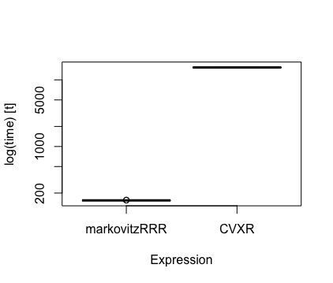

# markovitzRRR: Markovitz optimal portfolio via Reduced Rank Regression

<!-- badges: start -->
[](https://www.gnu.org/licenses/gpl-3.0)
[](https://github.com/a91quaini/markovitzRRR/actions/workflows/R-CMD-check.yaml)
<!-- badges: end -->

Author: Alberto Quaini

Efficient implementation of Markovitz optimal portfolio selection via Reduced Rank Regression. Optimal weights are given by:
$$w_{gmv} = \frac{\Sigma^{-1}\iota}{\iota'\Sigma^{-1}\iota},$$
where $\Sigma^{-1} = V[R]^{-1}$ is the inverse variance-covariance matrix of asset
excess returns $R\in\mathbb R^{T\times N}$. Optimal weights $w_{gmv}$ are computed by using:
$$\Sigma^{-1}=\text{diag}(V[E])(I - X),$$
where $I$ is the identity matrix,
$V[E]$ is the variance-covariance matrix of the residual in the regression
$$R=RX+E,$$
and $X\in\mathbb R^{N\times N}$ minimizes $f(X)$ subject to $\text{diag}(X)=0$, where (default):
$$f(X)=\frac{1}{2}F(R - RX)^2 + \lambda N(RX),$$
or (alternative):
$$f(X)=\frac{1}{2}F(R - RX)^2 + \lambda N(X),$$
where $\lambda>0$, $F(\cdot)$ denotes the Frobenius norm and $N(\cdot)$ 
the nuclear norm.

## Installation

### Building from source

To install the latest (possibly unstable) development version from
GitHub, you can pull this repository and install it from the `R` command
line via

```R
# if you already have package `devtools` installed, you can skip the next line
install.packages("devtools")
devtools::install_github("a91quaini/markovitzRRR")
```

Package `markovitzRRR` contains `C++` code that needs to be
compiled, so you may need to download and install the [necessary tools
for MacOS](https://cran.r-project.org/bin/macosx/tools/) or the
[necessary tools for
Windows](https://cran.r-project.org/bin/windows/Rtools/).


## Example

This is a basic example which shows you how to solve a common problem:

``` r
# required packages:
# install.packages("MASS")
# install.packages("CVXR")
# devtools::install_github("a91quaini/markovitzRRR")
# install.packages("microbenchmark)

# Set seed for reproducibility
set.seed(2)

# Simulate asset returns
n_assets <- 20
n_obs <- 100
mean_returns <- rep(0, n_assets)
variance_returns <- diag(1., n_assets)
returns <- MASS::mvrnorm(n_obs, mean_returns, variance_returns)

# Set penalty parameter lambda
lambda <- 0.05

# Define the markovitzRRR function call as a function
markovitzRRR_function <- function() {
  return(MarkovitzRRR(
    returns,
    lambda,
    objective_type = 'd',
    penalty_type = 'd',
    step_size_type = 'd',
    step_size_constant = 0.5e-2,
    max_iter = 10000,
     tolerance = 1e-12
  ))
}

X <- CVXR::Variable(n_assets, n_assets)
cost <- 0.5 * CVXR::sum_squares(returns - returns %*% X)
penalty <- lambda * CVXR::norm_nuc(returns %*% X)
constraint <- list(CVXR::diag(X) == 0)
problem <- CVXR::Problem(CVXR::Minimize(cost + penalty), constraint)

# Define the CVXR function call as a function
cvxr_function <- function() {
  return(CVXR::solve(problem, reltol = 1e-8, abstol = 1e-12, num_iter = 10000))
}

# check solutions
markovitzRRR_solution = markovitzRRR_function()
cvxr_solution = cvxr_function()

cat("MarkovitzRRR optimal value = ", round(min(markovitzRRR_solution$objective), 4), "\n")
cat("CVX optimal value = ", round(cvxr_solution$value, 4), "\n")

cat("Distance between MarkovitzRRR and CVX solutions = ",
    round(sum((markovitzRRR_solution$solution - cvxr_solution$getValue(X))^2), 15), "\n")
```

Solutions:
``` r
MarkovitzRRR optimal value =  821.6312
CVX optimal value =  821.6312 
Distance between MarkovitzRRR and CVX solutions =  1.97613e-08
```
<p float="left">

</p>

Benchmark:
``` r
# Run microbenchmark
mb <- microbenchmark::microbenchmark(
  markovitzRRR = markovitzRRR_function(),
  CVXR = cvxr_function(),
  times = 10
)

# Print the benchmark results
print(mb)

# Access specific metrics if needed
# print(summary(mb))
print(boxplot(mb))
```

Results:
``` r
Unit: milliseconds
         expr        min         lq       mean     median         uq        max neval
 markovitzRRR   154.7416   154.8898   155.3684   155.1661   155.3691   156.9844    10
         CVXR 15160.0323 15268.4862 15320.8739 15349.8701 15381.1129 15391.9638    10
```

<p float="left">

</p>


## References
