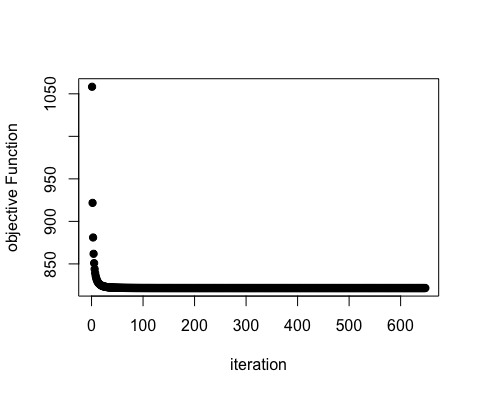

# markovitzRRR: Markovitz optimal portfolio via Reduced Rank Regression

<!-- badges: start -->
[](https://www.gnu.org/licenses/gpl-3.0)
[](https://github.com/a91quaini/markovitzRRR/actions/workflows/R-CMD-check.yaml)
<!-- badges: end -->

Author: Alberto Quaini

Efficient implementation of Markovitz optimal portfolio selection via Reduced Rank Regression. Optimal weights are given by:
$$w_{gmv} = \frac{\Sigma^{-1}\iota}{\iota'\Sigma^{-1}\iota},$$
where $\Sigma^{-1} = V[R]^{-1}$ is the inverse variance-covariance matrix of asset
excess returns $R\in\mathbb R^{T\times N}$. Optimal weights $w_{gmv}$ are computed by using:
$$\Sigma^{-1}=\text{diag}(V[E])(I - X),$$
where $I$ is the identity matrix,
$V[E]$ is the variance-covariance matrix of the residual in the regression
$$R=RX+E,$$
and $X\in\mathbb R^{N\times N}$ minimizes $f(X)$ subject to $\text{diag}(X)=0$, where (default)
$$f(X)=1/2F(R - RX)^2 + \lambda N(RX),$$ 
where $||\cdot||_{F}$ is the Frobenious norm, and 
$||\cdot||_*$ is the nuclear norm and $\lambda>0$,
or (alternative)
$$f(X)=1/2||R - RX ||_{F}^2 + \lambda ||X||_{*}.$$

## Installation

### Building from source

To install the latest (possibly unstable) development version from
GitHub, you can pull this repository and install it from the `R` command
line via

```R
# if you already have package `devtools` installed, you can skip the next line
install.packages("devtools")
devtools::install_github("a91quaini/markovitzRRR")
```

Package `markovitzRRR` contains `C++` code that needs to be
compiled, so you may need to download and install the [necessary tools
for MacOS](https://cran.r-project.org/bin/macosx/tools/) or the
[necessary tools for
Windows](https://cran.r-project.org/bin/windows/Rtools/).


## Example

This is a basic example which shows you how to solve a common problem:

``` r
library(markovitzRRR)

## simulate asset returns
set.seed(2)
n_assets = 20
n_obs = 100
mean_returns = rep(0, n_assets)
variance_returns = diag(1., n_assets)
returns = MASS::mvrnorm(n_obs, mean_returns, variance_returns)

# set penalty parameter lambda
lambda = .05

## compute Markovitz RRR solution
start_time_markovitz <- Sys.time()
# step_size_type can be:
# `'c'` for constant step size equal to `step_size_constant`;
# `'s'` for square summable but not summable given by `step_size_constant / (iteration + 1)`;
# `'p'` for modified Polyak given by `step_size_constant / ||subgradient||_F^2`;
# any other character gives a summable vanishing step size given by
# `step_size_constant / sqrt(iteration + 1)`.
markovitz_solution = MarkovitzRRR(
  returns,
  lambda,
  penalty_type = 'd',
  step_size_type = 'd',
  step_size_constant = .05e-1,
  max_iter = 500
)
end_time_markovitz <- Sys.time()
# plot objective function vs solver iterations
PlotMarkovitzRRRObjective(markovitz_solution)

## compute CVX solution
X = CVXR::Variable(n_assets, n_assets)
cost = .5 * CVXR::sum_squares(returns - returns %*% X)
penalty = lambda * CVXR::norm_nuc(returns %*% X)
constraint = list(CVXR::diag(X) == 0)

problem = CVXR::Problem(CVXR::Minimize(cost + penalty), constraint)

# Measure execution time for CVX
start_time_cvx <- Sys.time()
cvx_solution = CVXR::solve(problem, reltol = 1e-8, abstol = 1e-8, num_iter = 10000)
end_time_cvx <- Sys.time()

## Results
# Print the execution times
cat("MarkovitzRRR execution time:", end_time_markovitz - start_time_markovitz, "\n")
cat("CVX execution time:", end_time_cvx - start_time_cvx, "\n")

# Print optimal values
cat("MarkovitzRRR optimal value = ", round(min(markovitz_solution$objective), 4), "\n")
cat("CVX optimal value = ", round(cvx_solution$value, 4), "\n")

cat("Distance between MarkovitzRRR and CVX solutions = ",
    round(sum((markovitz_solution$solution - cvx_solution$getValue(X))^2), 15), "\n")
```

Execution time:
``` r
MarkovitzRRR execution time: 0.1697729 
CVX execution time: 15.35975 
```

Optimal value:
``` r
MarkovitzRRR optimal value =  821.6312 
CVX optimal value =  821.6312 
Distance between MarkovitzRRR and CVX solutions =  1.827446e-07 
```

<p float="left">

</p>

## References
